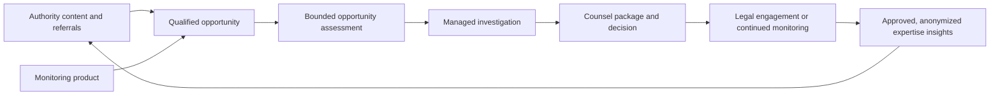

# Nicholas Lee Authority Site and Inbound Growth System

**Version:** 1.2
**Date:** 2026-07-13
**Status:** Fable reviewed; proposed for Alan, Nick, and Frank ratification
**Scope:** Growth, positioning, content, SEO/AI discovery, lead intake, product boundaries, design, and execution planning. No production redesign is authorized by this document.

## Executive Decision

For both the attorney and IP-owner ICPs, **Nicholas Lee is the trust anchor and CopyCatch is the capability proof**.

Attorneys receiving a cold introduction are unlikely to trust a software brand before they trust the practitioner behind it. Nick's site should therefore become the primary authority and relationship channel for attorney referrals. It must establish, in this order:

1. Nick is a practicing IP litigator with a focused Schedule A and marketplace-enforcement practice.
2. He understands the case economics and evidentiary work because he has handled the matters himself.
3. He co-founded CopyCatch to scale that practitioner-informed operating method.
4. A referring attorney can send a potential matter and receive a fast, bounded assessment of whether deeper investigation is warranted.

CopyCatch should not compete with Nick's authority. It should borrow and reinforce it until the product has enough independently verified customer proof to carry more trust on its own.

Two relationship decisions are locked for this plan:

- Nick's accurate public relationship is `Co-founder and IP litigator`.
- CopyCatch and Nick's legal practice are separate but connected. CopyCatch provides monitoring and factual investigation support; legal services require conflicts review and a separate engagement.

The broader business should operate as three connected but distinct channels:

| Channel | Primary job | Primary audience | Conversion |
|---|---|---|---|
| Nick's authority site | Establish practitioner trust and generate qualified legal/referral inquiries | Referring attorneys, patent owners, brands, inventors | Discuss a referral or evaluate a matter |
| CopyCatch managed service | Demonstrate the attorney-informed monitoring-to-investigation capability | Law firms and IP owners delegating the work | Request an assessment |
| Monitoring products | Generate recurring or per-scan monitoring revenue and surface escalation opportunities | Shopify brands, IP owners, marketplace operators | Subscribe, run a scan, or request escalation |

Legal representation, product use, and managed investigation must remain distinct in contracts, permissions, consent, claims, and data handling even when the customer journey moves between them.

## Why This Is the Highest-Leverage Move

The recent attorney referral validates the channel. The attorney did not ask to operate a dashboard. He approached an experienced practitioner, supplied a proposed product family and technical materials, and asked whether Nick could assist. The winning experience is therefore not "try our software." It is:

> Send Nick the opportunity. Nick and CopyCatch assess the live market surface. Receive a clear recommendation for the next investigative step.

The CrimpLok matter represents the complementary owner journey:

> Identify a recurring marketplace problem. Monitor it. Organize the strongest factual records. Escalate selected opportunities to counsel when appropriate.

Together, those patterns support one growth loop:

## Current-Site Audit

### What is already useful

- The custom domain is live and Nick's name is indexed.
- Nick's portrait, practitioner identity, and CopyCatch co-founder connection are visible.
- The contact form is functional, rate-limited, stored in Firestore, and routed to the firm Slack channel.
- Basic `Attorney` and `LegalService` structured data exists.
- The site avoids traditional legal stock imagery.
- Firebase hosting and existing portal functions provide a workable production foundation.

### Material gaps

1. **The site is one generic page.** It cannot establish topical authority for Schedule A, patent enforcement, attorney referrals, or marketplace-scale infringement.
2. **The trust sequence is backwards.** CopyCatch performance language appears before enough public, verifiable evidence of Nick's relevant practice experience.
3. **Audience journeys are mixed.** A referring attorney and a patent owner get the same generic form and CTA.
4. **The “Insights” navigation link returns 404.** This damages credibility and blocks the intended authority engine.
5. **`robots.txt` points to a missing sitemap.** `/sitemap.xml` returns 404.
6. **No useful attribution or funnel analytics are present.** The team cannot distinguish attorney referrals, owner inquiries, monitoring leads, or content-assisted conversions.
7. **Several public claims require a registry and verification.** Examples include “90% less manual work,” “90% lower cost,” “court-ready,” and categorical profitability language.
8. **The current visual system reads as a dark technology landing page.** It is polished enough for a first pass but does not yet feel like a deep practitioner authority property.
9. **Public credential facts are not yet managed as a source-backed registry.** Jurisdictions, firm history, matter experience, and outcome language need one approved source of truth.
10. **The contact form lacks a confidentiality warning and qualification structure.** It should not invite sensitive matter detail before conflicts and engagement are addressed.

## Positioning Architecture

### Category

**Patent enforcement and Schedule A litigation for marketplace-scale infringement.**

Patent enforcement is the wedge. Schedule A is the focused mechanism and attorney-referral hook. Trademark and copyright enforcement remain visible adjacent capabilities, but they should not dilute the first-screen practice focus.

### Core positioning statement

> Nicholas Lee is an IP litigator focused on patent enforcement and Schedule A matters involving marketplace-scale infringement. He combines his legal practice with CopyCatch, the investigative system he co-founded to turn a broad marketplace problem into an organized factual record for counsel.

This is working language, not final public copy. Every factual clause must pass the claims and credentials registry.

### Cross-site trust rule

For attorney-facing CopyCatch surfaces, the product must visibly answer:

- Who is the attorney behind this?
- Why was the system built?
- Where does human legal judgment enter?
- What does the service produce without claiming a legal conclusion?

Recommended CopyCatch treatment:

- “Co-founded by Nicholas Lee, an IP litigator with more than two decades of experience.”
- A concise Nick profile with a real portrait and link to the authority site.
- A clear distinction between factual investigation support and counsel's legal decisions.
- No isolated “AI engine” positioning that makes the attorney relationship feel incidental.

For monitoring apps, Nick may be less prominent during routine product use, but any enforcement escalation should introduce the attorney-led pathway before the user shares data or requests legal review.

### Authority transfer without legal-opinion implication

The desired visitor inference is:

> An experienced IP litigator helped build this service around the realities of enforcement, so the investigation is designed to produce information counsel can actually use.

The site must not create the unsupported inference that:

- every CopyCatch output is legal advice;
- Nick reviewed or approved every result;
- using CopyCatch creates an attorney-client relationship;
- Nick or his firm represents the visitor before conflicts and engagement; or
- a CopyCatch match is a legal infringement determination.

This is a net-impression rule, not a footer-disclaimer exercise. Headlines, portraits, labels, diagrams, CTAs, metadata, and nearby disclosures must communicate one coherent relationship. A disclaimer cannot be used to reverse an otherwise misleading first impression.

Use three distinct output states wherever review provenance matters:

| State | Meaning | Public/client rule |
|---|---|---|
| `CopyCatch reviewed` | CopyCatch completed its operational quality process | May describe process completion; never imply legal approval |
| `Ready for counsel` | A factual record or package passed the future promotion and quality gates | Do not render until those gates exist as auditable product events |
| `Attorney reviewed` | A named attorney reviewed that exact output | Show only when supported by reviewer identity, date, and an auditable event |

These labels are contract-derived, not copy tokens. The live product currently supports only `CopyCatch reviewed`. `Ready for counsel` stays unavailable until the promotion/quality gate exists, and `Attorney reviewed` stays unavailable until a per-output attorney-review event is recorded against an immutable revision. Templates must not hard-code any of the three.

Recommended relationship disclosure near enforcement CTAs:

> CopyCatch provides marketplace monitoring and organized factual records. It does not provide legal advice. Legal services, if requested, require conflicts review and a separate engagement.

### Standing advertising-compliance gate

Every Nick-site page, and every CopyCatch page using Nick's name, portrait, credentials, or practice description, must pass a per-page pre-publication review. The gate covers:

- credentials, admissions, practice history, and title;
- specialization or expertise language;
- representative matters and past-result implications;
- performance, cost, timing, evidence, and output claims;
- the visual relationship between Nick, his firm, and CopyCatch;
- the attorney-client and conflicts boundary; and
- jurisdiction-specific disclosures or filing requirements.

Growth owns the source registry and checklist. Nick or a designated legal reviewer owns approval. Material copy or layout changes reopen the gate; an approval does not carry forward automatically.

## Priority ICPs and Jobs

### ICP 1: Referring and collaborating IP attorneys

**Trigger:** A client or patent holder presents a marketplace-enforcement opportunity the attorney cannot efficiently investigate or does not want to operate alone.

**Questions the site must answer:**

- Does Nick have relevant experience with this kind of matter?
- Can he quickly evaluate whether the market opportunity justifies deeper work?
- What should I send him?
- Will he respect the referring relationship?
- What happens after I make the introduction?
- Is CopyCatch an attorney-informed service or merely generic software?

**Primary CTA:** `Discuss a referral`

### ICP 2: Patent owners, inventors, and product brands

**Trigger:** Repeated similar products or sellers appear across marketplaces, and ordinary platform reports have not solved the problem.

**Questions:**

- Is my patent a plausible enforcement starting point?
- How large might the marketplace surface be?
- What information is needed before legal action is considered?
- Can this begin with a bounded assessment instead of a full engagement?

**Primary CTA:** `Evaluate my matter`

Owner intake begins with one routing question: `Do you have an active dispute or counsel involved?` An active matter stays in the law-practice conflicts path. Monitoring-only demand visibly exits the law-practice context and moves to CopyCatch. Any later enforcement re-entry requires fresh consent and a new conflicts check; no owner data moves silently between the two.

### ICP 3: Monitoring-first IP owners

**Trigger:** Recurring or episodic suspected copying creates a need for ongoing monitoring or a one-time scan.

**Journey:** Route product demand to CopyCatch's monitoring experience. Introduce legal escalation only when the customer requests it, with explicit consent and conflict checks.

**Primary CTA:** `Monitor my IP`

### Secondary ICPs

- Trademark owners facing repeated marketplace misuse.
- Copyright owners with repeatable visual or content patterns.
- Law firms seeking investigation or evidence support without transferring the legal engagement.

## Proposed Information Architecture

### P0 launch pages

| Route | Job | Primary CTA |
|---|---|---|
| `/` | Establish Nick's authority, practice focus, method, and two main audiences | Discuss a referral |
| `/for-attorneys` | Explain the referral/collaboration pathway and what to send | Discuss a referral |
| `/schedule-a-litigation` | Own the focused category and explain the process without promising outcomes | Discuss a matter |
| `/about` | Present source-backed credentials, career narrative, and CopyCatch origin | Contact Nick |
| `/copycatch` | Bridge to the separate company: what it is, why Nick co-founded it, and the boundary | Explore CopyCatch |
| `/contact` | Route attorney, owner, and monitoring inquiries through separate light paths | Send inquiry |

### P1 expansion pages

| Route | Purpose |
|---|---|
| `/patent-enforcement` | Add only after the Schedule A and homepage content establish enough distinct owner demand |
| `/e-commerce-ip-enforcement` | Connect patents, trademarks, and copyrights to marketplace enforcement |
| `/trademark-enforcement` | Expansion service page after Nick approves scope and claims |
| `/copyright-enforcement` | Expansion service page after Nick approves scope and claims |
| `/representative-matters` | Source-backed public matter experience, subject to client and ethics review |
| `/insights/[slug]` | Practitioner-authored answer pages and case perspectives |
| `/insights` | Add to navigation only after at least three approved substantive pieces are live |
| `/referral-received` | Private-feeling confirmation with response expectations and next steps |

### Navigation principle

Do not expose every product or practice area in top navigation. Recommended top-level navigation:

`For Attorneys` · `Schedule A` · `About` · `Contact`

CopyCatch should appear as corroborating capability in the second viewport and on the bridge page, not as the organizing category or a first-viewport product pitch.

## Homepage First-Viewport Specification

The first viewport should establish five facts in under five seconds:

1. The person is Nicholas Lee.
2. He is a practicing IP litigator.
3. His distinctive specialty is patent enforcement and Schedule A litigation.
4. He has more than 20 years of relevant practice, once verified.
5. Attorneys can discuss a referral directly with him.

Recommended structure:

- H1: `Nicholas Lee`
- Category line: `Patent Enforcement and Schedule A Litigation`
- Support: a precise sentence connecting marketplace-scale infringement, legal experience, and the CopyCatch investigative capability.
- Primary CTA: `Discuss a referral`
- Secondary CTA: `Evaluate a matter`
- Real portrait, not an abstract AI visual.
- A visible hint of the next authority-proof section on desktop and mobile.
- No CopyCatch logo, screenshot, performance claim, or dark-technology framing in the first viewport.
- CopyCatch first appears in the second viewport as one sourced origin line linking to the bridge page.

Do not lead with software metrics, dashboards, “AI-powered,” or generic “IP litigation and strategy.”

Attorney-facing CopyCatch pages should use a parallel first-viewport trust pattern:

- The managed-service category or offer remains the H1.
- A visually separate provenance block names Nick as `Co-founder · practicing IP litigator` and links to his authority profile.
- Nick's portrait appears inside that provenance block, never adjacent to output imagery or a specific record.
- The operative sentence describes factual monitoring, investigation, or organized records.
- The legal-services boundary sits immediately below the Nick block and before the first enforcement-escalation action.
- The block describes origin, not ongoing firm supervision or per-output attorney review.

## Authority Proof Stack

Build trust through verifiable layers, in this order:

1. **Identity and credentials:** bar status, education, practice history, court admissions, and current firm role.
2. **Specific practice focus:** Schedule A, patent enforcement, marketplace-scale investigation, and pre-filing decision support.
3. **Public matter experience:** selected public dockets and procedural facts, only after Nick approves wording.
4. **Practitioner method:** how an inbound opportunity is assessed, scoped, investigated, and prepared for counsel.
5. **Original analysis:** useful, sourced writing answering questions actual attorneys and IP owners ask.
6. **CopyCatch:** the system Nick co-founded to scale the research and documentation burden encountered in enforcement work.

Do not substitute testimonials, invented case counts, generic badges, or unverified outcome claims for this stack.

## Content and AI-Citation Strategy

### Editorial principle

Publish fewer, substantially better pages based on Nick's first-hand experience. Google explicitly recommends original, people-first content with clear authorship and demonstrable expertise. Mass-produced AI summaries would weaken the exact authority signal the site needs.

Every insight should include:

- a direct answer near the top;
- Nick's byline and a linked author profile;
- original practitioner analysis;
- public primary sources where available;
- “last reviewed” date;
- a visible distinction between general information and legal advice;
- a short explanation of any AI-assisted research or drafting when material;
- descriptive headings, definitions, and concise tables where useful; and
- a contextual next step for attorneys or owners.

### Initial content pillars

1. **Schedule A opportunity evaluation**
2. **Patent enforcement against marketplace sellers**
3. **Pre-filing investigation and evidentiary preparation**
4. **Monitoring-to-enforcement decisions**
5. **Marketplace seller and product-family research**
6. **Trademark and copyright expansion**, only after the patent wedge is established

### First ten high-intent content candidates

1. What should a referring attorney send for an initial Schedule A opportunity review?
2. How do you evaluate whether a patent enforcement opportunity has enough marketplace surface?
3. What can public marketplace listings establish before a patent case is filed?
4. What evidence gaps usually require video, a test buy, or technical analysis?
5. What is the difference between marketplace monitoring and pre-suit investigation?
6. How are repeated listings and seller accounts organized before counsel review?
7. When does a recurring marketplace problem justify ongoing monitoring?
8. Can utility patent matters use a multi-defendant Schedule A strategy?
9. What makes an e-commerce IP matter suitable for a bounded initial assessment?
10. What should patent owners know before estimating the size of an online enforcement opportunity?

Titles are research hypotheses. Nick must approve the legal premise and final answer before publication.

### Technical discovery requirements

- Remove or redirect the broken `/blog` navigation path immediately. Launch the real `/insights` hub only when at least three approved pieces are live.
- Generate a valid XML sitemap and submit it through Search Console.
- Explicitly allow `OAI-SearchBot` if AI-search discovery is desired. Decide separately whether to allow `GPTBot` training access.
- Add canonical URLs, breadcrumbs, Article schema, Person schema, and accurate Attorney/LegalService data.
- Use FAQ schema only when the questions and answers are visibly present and eligible.
- Create an RSS or Atom feed.
- Add `llms.txt` only as a supplemental navigation artifact, never as a substitute for crawlable source pages.
- Register Google Search Console and Bing Webmaster Tools.
- Track ChatGPT and other AI referral traffic separately when referrer data is available.

## Clio Case-Experience Research Protocol

Clio can help reveal Nick's real experience patterns, but it should be treated as a confidential source system, not a content database.

### Governing rule

**Nothing from Clio becomes public merely because it is technically accessible.**

The API should initially be used to discover aggregate practice patterns and candidate public matters. Public content must then be verified against public records and approved by Nick. Client names, communications, documents, billing narratives, strategy notes, and nonpublic outcomes stay out of marketing workflows unless specifically authorized.

### Phased access

#### Phase C0: Schema-only inventory

- Create a read-only OAuth application with the minimum Clio permissions.
- Inventory available endpoints and fields without exporting matter values.
- Document data region, pagination, rate limits, redaction behavior, and retention.
- Never paste access tokens into chat. Store them in the approved secret store.

#### Phase C1: Minimal aggregate taxonomy

Retrieve only the minimum fields needed to understand practice composition, such as pseudonymous matter ID, status, open/close dates, responsible attorney, practice-area/custom-field categories, and other Nick-approved non-content metadata.

Explicitly exclude during the first pass:

- client and contact identity;
- document bodies or files;
- communications and notes;
- billing descriptions or amounts;
- opposing-party detail;
- confidential matter descriptions; and
- unstructured text not required for the aggregate question.

Desired output:

- matter counts by approved practice taxonomy;
- approximate recency and duration distributions;
- candidate categories for deeper manual review;
- data-quality and classification gaps; and
- a list of public-record verification tasks.

#### Phase C2: Nick-approved stratified sample

- Nick selects a small representative set from the aggregate taxonomy.
- Review only the fields and documents needed to understand the matter archetype.
- Produce internal, source-linked experience cards.
- Mark every fact as `publicly verifiable`, `client-authorized`, `internal only`, or `not usable`.

#### Phase C3: Public-record corroboration

- Match approved matters to PACER, CourtListener, USPTO, TTAB, or other primary public sources.
- Draft public matter descriptions from public procedural facts rather than confidential Clio narrative.
- Obtain Nick's approval and any necessary client consent before publication.

#### Phase C4: Content insight extraction

Use recurring questions, procedural patterns, and research challenges to generate editorial briefs. Do not publish case-specific facts unless the preceding gates passed.

### Data controls

- Run analysis in a restricted workspace.
- Use field allowlists rather than broad exports.
- Hash or replace internal identifiers in analytic outputs.
- Keep raw Clio data out of Fable, Claude Design, and other third-party design contexts.
- Log extraction purpose, actor, fields, date, and deletion date.
- Establish a short raw-data retention period.
- Require Nick's approval for any public claim derived from the analysis.

Clio's API supports explicit field selection, permission-scoped access, pagination, and redaction behavior. We should use those controls rather than downloading the account wholesale.

## Lead Intake and Backend Plan

### Current problem

The existing form captures name, contact information, a broad persona, and free text. It routes leads successfully but does not preserve source attribution, distinguish referral intent, or protect prospects from oversharing confidential information.

### P0 intake model

Create two short entry paths plus one owner-routing branch:

1. `Attorney referral`
2. `Owner inquiry` -> `active matter / counsel involved` or `monitoring only`

Shared minimum fields:

- name;
- work email;
- organization or firm;
- inquiry type;
- IP type;
- rights identifier, optional;
- one representative public product or source link, optional;
- a structured, concise nonconfidential summary;
- preferred next step; and
- consent to the privacy notice.

Show before the message field:

> Please do not send confidential information. Submitting this form does not create an attorney-client relationship.

Final wording requires Nick's legal approval.

The pre-conflicts form must not request accused-party names, confidential communications, litigation strategy, nonpublic evidence, or detailed factual narratives. Conflicts review is the first stated step. The monitoring branch must make the transition out of the law-practice context explicit; enforcement re-entry requires fresh consent.

### Routing and lifecycle

Capture server-side:

- landing page;
- CTA and form path;
- UTM parameters;
- referrer domain;
- submitted timestamp;
- lead type;
- qualification status; and
- routing destination.

Recommended lifecycle:

`new` -> `conflict check needed` -> `qualified for call` -> `consultation` -> `engaged`, `CopyCatch route`, `referred`, or `declined`

Do not automatically create a legal matter, transfer monitoring-product data to the firm, or imply legal review before consent, conflict clearance, and engagement rules are satisfied.

### Response experience

- Attorneys receive a peer-to-peer confirmation describing the limited information useful for a first conversation.
- IP owners receive a short explanation of the assessment process.
- Monitoring leads are routed to the appropriate CopyCatch product or assessment path.
- The internal alert should identify lead type, source page, and urgency without exposing sensitive form text to analytics.

## Measurement Plan

### North-star metric

**Qualified inbound opportunities that reach a substantive conversation with Nick.**

### Funnel metrics

- qualified attorney referrals by source;
- qualified IP-owner matters by source;
- monitoring leads routed to CopyCatch;
- inquiry-to-consultation conversion;
- consultation-to-engagement or managed-investigation conversion;
- median first-response time;
- content-assisted qualified opportunities;
- organic landing pages that produce qualified leads; and
- monitoring-to-escalation requests with explicit consent.

### Supporting search metrics

- impressions and clicks for high-intent Schedule A and patent-enforcement queries;
- branded search growth for Nicholas Lee;
- referring domains and public citations;
- AI-search referral sessions;
- index coverage and crawl errors; and
- conversion by page and ICP.

Do not optimize around raw traffic, social impressions, or article volume without qualified-lead evidence.

### Privacy rule

Analytics must never receive free-text inquiry content, rights identifiers, product links, party names, or portal activity. Track interaction metadata only.

## Visual and UX Direction

### Design objective

The site should feel like a premium focused practice with unusual technical depth, not a CopyCatch product subpage and not a conventional law-firm template.

### Recommended design principles

- Nick's name, portrait, and approved practice focus are first-viewport signals.
- Use real practitioner, public-record, and investigative-work visuals where authorized.
- Share disciplined typography and precision with CopyCatch, but do not make violet or “AI” the dominant identity.
- Favor a balanced light/dark system or a brighter authority-led canvas over an endless black page.
- Use one restrained accent and low motion.
- Make content easy to cite, scan, print, and share.
- Avoid gavels, scales, columns, handshakes, generic dashboards, fake document renders, fake metrics, and decorative AI imagery.
- Mobile referral and contact paths must be first-class; many attorneys will open shared links on a phone.

### Claude Design bake-off

After positioning and page specs are approved, ask Claude Design for three genuinely distinct systems using the same real copy and portrait:

1. **Practitioner Authority:** portrait-led, contemporary professional publishing.
2. **Technical Counsel:** precise diagrams, product-family mapping, and restrained evidence framing.
3. **Strategic Briefing:** high-stakes peer-to-peer consultation with quiet, private-room confidence.

Required bake-off screens:

- homepage at 1440 and 390;
- attorney referral page at 1440 and 390;
- patent enforcement page;
- insight article;
- contact/intake path;
- mobile navigation; and
- error, confirmation, and no-results states.

Judge on five-second attorney trust, clarity of specialty, conversion, content scalability, claims safety, mobile quality, and its ability to coexist with CopyCatch without looking like the same site.

## Product and Entity Boundaries

### Nick's law practice

- Owns legal consultations, conflicts, engagements, legal advice, and counsel decisions.
- May receive attorney referrals and owner inquiries.
- Must control public statements about experience, results, and representative matters.

### CopyCatch managed service

- Owns monitoring, marketplace research, factual record organization, and managed investigation support.
- Does not present generated data as legal conclusions.
- Uses Nick's authority as co-founder/practitioner context without implying every product result has received legal review.

### Monitoring products

- Own subscriptions, one-time scans, monitoring history, and product-level alerts.
- May offer `Request escalation`, but that action must explain data sharing, consent, conflicts, and the separate legal-engagement step.
- Must not silently route customer data into the law firm.

Frank and Nick should ratify the legal-entity, referral, fee, consent, and data-sharing boundaries before cross-product escalation is implemented.

## Team Operating Model

### Alan - Growth and Product Lead

- ICP, positioning, copy, CRO, content roadmap, search strategy, analytics requirements, and design QA.
- Owns the cross-site narrative and claims-registry discipline.

### Nick - Subject-Matter and Legal Authority

- Approves specialty language, credentials, public matter facts, legal explanations, content, engagement boundaries, and lead qualification.
- Supplies practitioner insight and feedback on lead quality.

### Frank - CTO and Technical Lead

- Owns repository/harness architecture, deployment strategy, data contracts, security, Clio integration, analytics plumbing, and monitoring-product implementation.
- Determines the most efficient separation of site, platform, and app codebases.

### Agent lanes

- Lead Opportunity Researcher: interprets inbound opportunities and prepares bounded research strategy.
- Marketplace research agents: collect and enrich authorized marketplace data.
- Design agents: work only from sanitized content and approved design briefs.
- Frontend and backend agents: implement against ratified page specs, contracts, and ownership boundaries.

### Shared second brain

Frank's proposed shared `workflows/` repository should hold cross-product artifacts that are not secrets or case data:

- `strategy/` - ICP, positioning, ecosystem map;
- `claims/` - public claims and source approvals;
- `page-specs/` - route-level goals and copy contracts;
- `content/` - editorial briefs and status;
- `contracts/` - cross-product event and data boundaries;
- `research/` - sanitized findings and query maps;
- `decisions/` - ratified product decisions;
- `handoffs/` - lane ownership and acceptance criteria; and
- `status/` - current sprint and blockers.

Raw Clio data, client files, credentials, and research-agent operating details do not belong there.

## Execution Roadmap

### Days 0-30: Truth cleanup and conversion structure

1. Ratify the Nick-first category and cross-site roles.
2. Create the source-backed credentials, claims, and per-page advertising-compliance gate.
3. Delete unsupported performance, profitability, and `court-ready` language rather than qualifying it.
4. Launch the six-page P0 architecture and keep CopyCatch out of Nick's first viewport.
5. Fix navigation and sitemap behavior; do not add an empty Insights navigation item.
6. Implement CTA attribution, the conflicts-safe owner-routing question, and nonconfidential structured intake.
7. Conduct the Nick authority interview and run Clio Phase C0 schema inventory only.

**Falsifier:** Five uninvolved IP litigators view the homepage for 15 seconds. If any describes Nick primarily as a software founder, cannot identify the Schedule A/patent-enforcement practice focus, or recalls an unsupported performance claim, the phase fails.

### Days 31-60: Authority proof and the CopyCatch bridge

1. Verify and approve the `/about` credentials and practice narrative.
2. Launch `/copycatch` as a boundary-first bridge page, not a product pitch.
3. Add the visually separate Nick provenance module to attorney-facing CopyCatch pages.
4. Keep only the event-supported `CopyCatch reviewed` label; sweep all public/client templates for the unreleased states.
5. Complete the owner routing and fresh-consent enforcement re-entry behavior.
6. Run the Claude Design bake-off and implement the approved responsive system.

**Falsifier:** Cold readers view the attorney-facing CopyCatch page and answer `Who reviewed these records?` Any answer of `Nick` or `his firm`, absent a real per-output review event, fails the phase. Any shipped `Ready for counsel` or `Attorney reviewed` string also fails.

### Days 61-90: Evidence-gated authority engine

1. Complete the narrow Clio aggregate taxonomy and Nick-selected sample.
2. Verify every publishable experience fact against public records.
3. Publish two or three Nick-authored cornerstone pieces; add `/insights` to navigation only after three are live.
4. Add `/patent-enforcement` only if the approved content is distinct from the homepage and Schedule A page.
5. Review lead attribution and qualified-conversation data before expanding the IA.
6. Add representative matters only after public-record corroboration and per-page legal approval.

**Falsifier:** Trace every factual statement in one published insight to an approved credential source, public record, or clearly labeled practitioner opinion. One statement sourced only to raw client data or to no evidence fails the phase and stops the publishing pipeline.

### Later: Product-led monitoring and escalation loop

1. Launch the Shopify-native monitoring wedge.
2. Test Amazon app feasibility and platform constraints separately.
3. Add one-time scan and recurring monitoring offers.
4. Add consented escalation requests into the managed-service and legal-intake pathways.
5. Feed anonymized, approved pattern insights into the content backlog.
6. Measure which product alerts produce qualified managed-service or legal opportunities.

## P0 Acceptance Criteria

The first redesign is ready to launch only when:

- a skeptical referring attorney can identify Nick's practice focus within five seconds;
- the attorney and owner journeys have distinct pages, CTAs, and confirmation copy;
- CopyCatch does not appear in Nick's first viewport and appears first as corroborating origin/capability;
- every credential, metric, result, and product claim has a source and approval state;
- every Nick-site page and Nick-bearing CopyCatch page has a current advertising-compliance approval;
- no confidential Clio or client data enters public content or design tooling;
- `/sitemap.xml`, canonical tags, and structured data validate; `/insights` stays out of navigation until three approved pieces are live;
- desktop and mobile routes have no overflow, overlap, or hidden primary actions;
- the contact form blocks premature confidential detail, begins with conflicts review, and preserves source attribution;
- analytics exclude sensitive fields;
- CopyCatch visibly connects to Nick's practitioner authority on attorney-facing surfaces;
- only event-supported review labels render; unreleased `Ready for counsel` and `Attorney reviewed` states do not appear in templates;
- product monitoring, managed investigation, and legal engagement remain distinct; and
- Firebase portal routes and functions regress cleanly after the marketing-site rebuild.

## Decisions Needed From Alan, Nick, and Frank

1. Is `Patent Enforcement and Schedule A Litigation` the approved first-screen category?
2. Does Nick want attorney referrals to be the homepage primary CTA, with owner matters secondary?
3. Which career, jurisdiction, and matter facts can be publicly sourced and approved?
4. Which CopyCatch claims survive the claims audit?
5. Should the law-firm and CopyCatch sites share only design discipline, or also specific brand tokens?
6. Which CRM owns pre-engagement leads: Clio Grow, Clio Manage after clearance, or a separate lightweight opportunity store?
7. What exact consent is required when a monitoring customer requests legal escalation?
8. Which public matters can be used as representative experience?
9. Will Clio analysis run only in a firm-controlled environment, and what is the raw-data retention window?
10. Does Frank prefer preserving the current static architecture or migrating public content to a static content framework while retaining Firebase hosting and portal functions?

Locked and removed from the open-decision list:

- Nick is presented as `Co-founder and IP litigator`.
- CopyCatch and Nick's legal practice are separate but connected.
- Nick is the cross-site trust anchor; CopyCatch remains the factual capability proof.

## Fable Review Outcome

Fable reviewed a sanitized version of this plan in the dedicated CC chat. No Clio exports, client names, confidential files, agent mechanics, credentials, or fee arrangements were shared.

Accepted recommendations:

1. Add a standing per-page attorney-advertising compliance gate rather than a one-time claims cleanup.
2. Separate Nick-as-origin visually from product outputs so his portrait and title do not imply firm supervision or per-record review.
3. Keep CopyCatch out of Nick's first viewport and make `/copycatch` a boundary-first bridge page.
4. Render review labels only from real events and expose only the currently supported `CopyCatch reviewed` state.
5. Replace separate owner doors with a conflicts-safe routing question, explicit context exit, and fresh-consent enforcement re-entry.
6. Reduce P0 to six pages and hold the Insights hub until three approved pieces exist.
7. Use falsifying attorney/reader tests at 30, 60, and 90 days instead of relying on internal design approval.

Growth independently accepted these changes because they follow from the observed referral path, current product contracts, existing site audit, and the net-impression rule. The review did not reopen managed-service positioning, pricing, product claims, or unverified experience language.

## Primary References

- [Google: Creating helpful, reliable, people-first content](https://developers.google.com/search/docs/fundamentals/creating-helpful-content)
- [Google: LocalBusiness structured data](https://developers.google.com/search/docs/appearance/structured-data/local-business)
- [Google: Organization structured data](https://developers.google.com/search/docs/appearance/structured-data/organization)
- [Google: Search Console basics](https://developers.google.com/search/docs/monitor-debug/search-console-start)
- [OpenAI: Publishers and developers FAQ](https://help.openai.com/en/articles/12627856-publishers-and-developers-faq)
- [Clio Manage API overview](https://docs.developers.clio.com/api-docs/clio-manage/)
- [Clio field-selection guidance](https://docs.developers.clio.com/api-docs/clio-manage/fields/)
- [Clio API permissions](https://docs.developers.clio.com/api-docs/clio-manage/permissions/)
- [Illinois Supreme Court Rules, including Rules 1.6, 7.1, and 7.2](https://www.illinoiscourts.gov/supreme-court-rules/)
